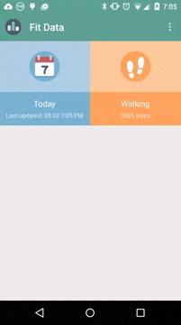
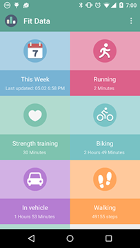

#  Reading Google Fit Data
Example app using the Google Fit history API. Currently, the app summarizes duration and step count by activity type. The detail pages will show graphs of activity level by day or by week. All data is cached in a local SQLite database and synchronized with the Google Fit API.

&nbsp;&nbsp;&nbsp;

Setup Instructions
---------
Fabric & Firebase API keys are required to run the lastest version of this project. They have not been checked in to the public version of this repository. You will either need to set up accounts for both or remove references to these libraries in the code.

This application requires access to the GoogleFit API on a real device. Running the code in the emulator may not produce the expected results. Better emulator support with mock data may be added at some point in the future. 

Icons
---------------------------
+ [Iconpack](http://www.iconarchive.com/show/beautiful-flat-one-color-icons-by-elegantthemes.html)

Resources
---------------------------
+ [Material Everywhere](http://antonioleiva.com/material-design-everywhere/)
+ [Google Fit Tutorial](http://orange.dataart.com/how-to-use-googlefit-api/)
+ [Cupboard Tutorial](https://guides.codepath.com/android/Easier-SQL-with-Cupboard)

Third Party Libraries
---------------------------
+ [AChartEngine](https://code.google.com/p/achartengine/)
+ [Cupboard](https://bitbucket.org/qbusict/cupboard) 
+ [Floating Action Menu](https://github.com/futuresimple/android-floating-action-button)